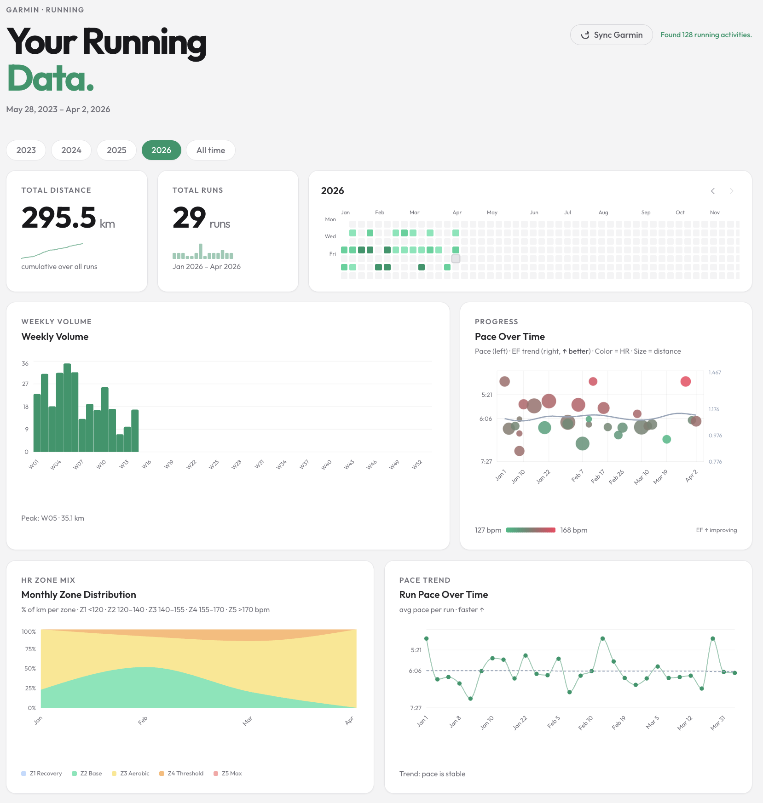

# Garmin Dashboard

A Next.js dashboard for visualizing Garmin running data pulled directly from Garmin Connect.



## How it works

1. **Data source** — Activities are fetched from Garmin Connect using your account credentials via the unofficial Garmin Connect API. The sync stores activity data locally in `Activities.csv`.
2. **Sync** — Hit the **Sync** button in the UI to pull your latest activities. The app calls `/api/sync`, which authenticates with Garmin Connect and writes new activities to the CSV.
3. **Visualizations** — The dashboard reads from the CSV and renders charts for pace, heart rate zones, weekly mileage, and other running metrics using Recharts.
4. **Stack** — Next.js (App Router) + TypeScript + Tailwind CSS + Recharts, deployable via Docker.

## Setup

### 1. Configure credentials

Copy `.env.example` to `.env` and fill in your Garmin Connect credentials:

```bash
cp .env.example .env
```

```
GARMIN_EMAIL=you@example.com
GARMIN_PASSWORD=yourpassword
```

> **Note:** If your password contains a `#`, wrap the value in quotes:
> ```
> GARMIN_PASSWORD="p@ss#word"
> ```

### 2. Run with Docker

```bash
docker compose up --build
```

Open [http://localhost:3000](http://localhost:3000).

The dashboard loads from the bundled `Activities.csv`. Hit **Sync** to pull your latest activities from Garmin Connect.

---

To stop:

```bash
docker compose down
```
